## 1. Product Overview
Sistema de gerenciamento de dados empresariais com interface intuitiva para administração de contas, pessoas (fornecedores, clientes, faturados) e classificações financeiras (receitas/despesas).

O produto resolve o problema de gestão desorganizada de dados empresariais, permitindo controle centralizado com funcionalidades de CRUD completo e exclusão lógica por status.

## 2. Core Features

### 2.1 User Roles
| Role | Registration Method | Core Permissions |
|------|---------------------|------------------|
| Administrador | Login único via sistema | Acesso total a todas as funcionalidades de gerenciamento |
| Usuário Comum | Login via sistema | Visualização e edição limitada (somente ativos) |

### 2.2 Feature Module
O sistema de gerenciamento BD consiste nos seguintes módulos principais:
1. **Página Gerenciamento BD**: Dashboard principal com tabela de registros, filtros, busca avançada e ações de CRUD.
2. **Modal de Cadastro/Edição**: Formulários dinâmicos para criar e editar registros com validação em tempo real.

### 2.3 Page Details
| Page Name | Module Name | Feature description |
|-----------|-------------|---------------------|
| Gerenciamento BD | Tabela de Registros | Exibir dados em formato tabular com indexação por coluna, paginação e ordenação automática. Carrega inicialmente apenas registros com status ATIVO. |
| Gerenciamento BD | Busca Avançada | Permitir busca por múltiplos campos simultaneamente (nome, código, CPF/CNPJ, email) com filtros dinâmicos. |
| Gerenciamento BD | Ações na Tabela | Botões de editar e excluir (lógico) para cada registro com confirmação de ações críticas. |
| Gerenciamento BD | Carregamento de Dados | Botão "TODOS" carrega todos os registros ATIVOS, busca específica carrega conforme filtros aplicados. |
| Modal Cadastro | Formulário Contas | Campos: código, nome, tipo (banco/caixa), saldo inicial, status (oculto = ATIVO). |
| Modal Cadastro | Formulário Pessoas | Campos: código, nome, CPF/CNPJ, email, telefone, tipo (fornecedor/cliente/faturado), status (oculto = ATIVO). |
| Modal Cadastro | Formulário Classificação | Campos: código, nome, tipo (receita/despesa), status (oculto = ATIVO). |
| Modal Edição | Formulários Dinâmicos | Mesmos campos do cadastro com status visível para alteração entre ATIVO/INATIVO. |

## 3. Core Process
### Fluxo Principal do Administrador:
1. Acessa página Gerenciamento BD → Visualiza tabela vazia inicialmente
2. Clica em "TODOS" ou aplica busca → Sistema carrega registros ATIVOS
3. Seleciona tipo de dado (Contas/Pessoas/Classificação) via abas ou dropdown
4. Realiza ações: 
   - **Criar**: Abre modal, preenche formulário, salva (status = ATIVO)
   - **Editar**: Clica ícone editar, altera dados, salva
   - **Excluir**: Clica ícone lixeira, confirma, sistema altera status para INATIVO
5. Sistema atualiza tabela automaticamente após cada ação

```mermaid
graph TD
  A[Página Gerenciamento BD] --> B[Tabela Vazia]
  B --> C{Escolher Ação}
  C --> D[Buscar/TODOS]
  C --> E[Novo Registro]
  C --> F[Editar Registro]
  C --> G[Excluir Registro]
  D --> H[Carregar Dados ATIVOS]
  E --> I[Modal Cadastro]
  F --> J[Modal Edição]
  G --> K[Confirmar Exclusão]
  I --> L[Salvar - Status ATIVO]
  J --> M[Atualizar - Manter Status]
  K --> N[Alterar p/ INATIVO]
  H --> O[Tabela Atualizada]
  L --> O
  M --> O
  N --> O
```

## 4. User Interface Design
### 4.1 Design Style
- **Cores Primárias**: Azul profissional (#2563eb) para elementos principais, verde (#10b981) para sucesso
- **Cores Secundárias**: Cinza claro (#f3f4f6) para fundos, vermelho (#ef4444) para ações destrutivas
- **Botões**: Estilo moderno com bordas arredondadas (8px), sombra sutil e hover effects
- **Fontes**: Inter para textos principais, tamanhos: 14px tabela, 16px formulários, 18px títulos
- **Layout**: Card-based com sombras suaves, navegação superior com abas para módulos
- **Ícones**: Heroicons para consistência, cores monocromáticas com destaque em ações

### 4.2 Page Design Overview
| Page Name | Module Name | UI Elements |
|-----------|-------------|-------------|
| Gerenciamento BD | Header | Título "Gerenciamento BD", selector de módulo (Contas/Pessoas/Classificação), botão "Novo" destacado em azul |
| Gerenciamento BD | Barra de Busca | Campo de texto expansível com placeholder "Buscar por nome, código, CPF, email...", botão "Buscar" e "Limpar Filtros" |
| Gerenciamento BD | Tabela | Cabeçalho fixo com ícones de ordenação, linhas alternadas em cinza claro, hover azul muito suave, largura automática por coluna |
| Gerenciamento BD | Ações Tabela | Ícones lápis (editar) e lixeira (excluir) na última coluna, com tooltips explicativos ao hover |
| Gerenciamento BD | Paginação | Rodapé com info "Mostrando X de Y registros", botões numéricos e navegação anterior/próximo |
| Modal Cadastro/Edição | Formulário | Labels acima dos campos, inputs com bordas arredondadas, validação em tempo real com bordas vermelhas em erros |
| Modal Cadastro/Edição | Botões de Ação | "Cancelar" (cinza outline) e "Salvar" (azul sólido), ambos com largura proporcional e espaçamento adequado |

### 4.3 Responsiveness
- **Desktop-first**: Otimizado para telas grandes (1200px+), aproveitando espaço horizontal para tabelas
- **Mobile-adaptive**: Layout empilhado em telas menores que 768px, tabela transforma em cards expansíveis
- **Touch optimization**: Botões e links com área de toque mínima de 44x44px, scroll suave em tabelas