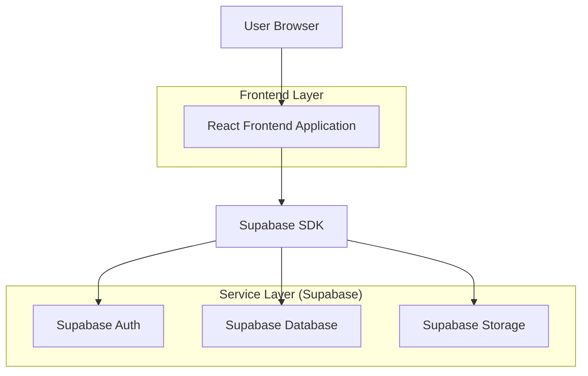
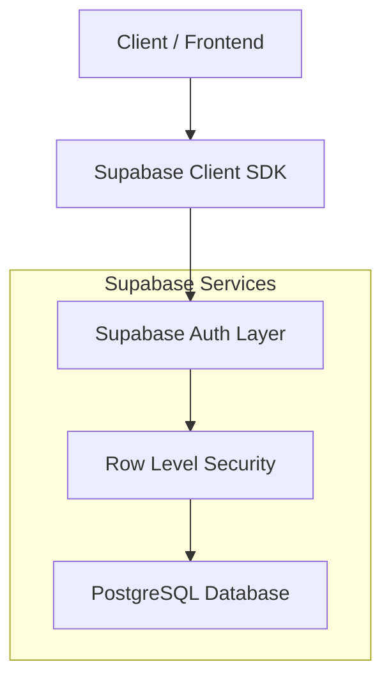
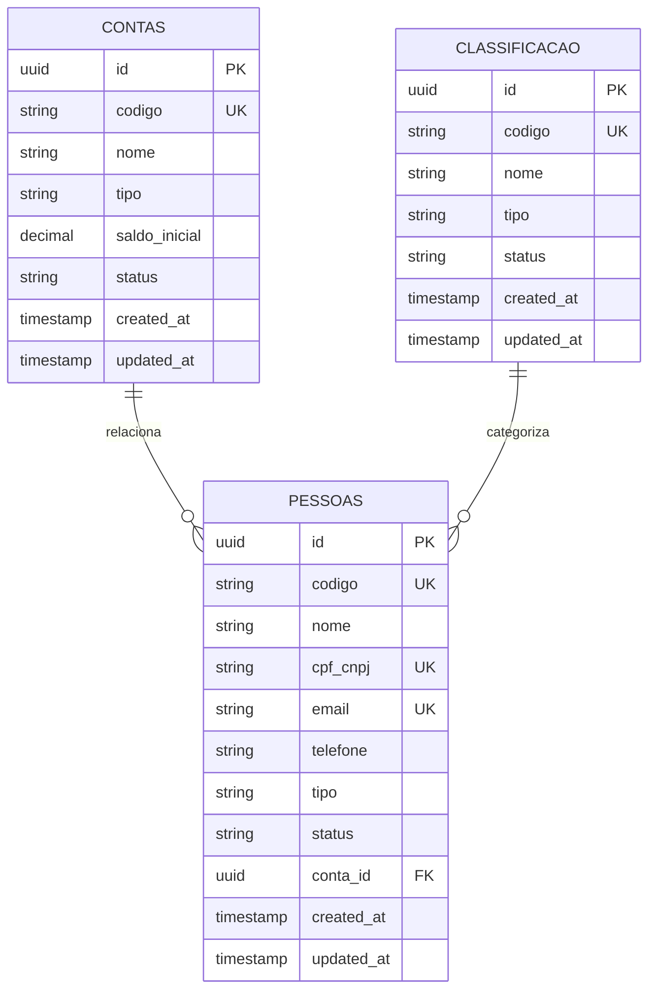

## 1. Architecture design



## 2. Technology Description
- Frontend: React@18 + tailwindcss@3 + vite
- Initialization Tool: vite-init
- Backend: Supabase (BaaS)
- Database: PostgreSQL (via Supabase)
- Authentication: Supabase Auth

## 3. Route definitions
| Route | Purpose |
|-------|---------|
| /gerenciamento-bd | Página principal de gerenciamento com tabela e filtros |
| /login | Página de autenticação do administrador |
| /dashboard | Dashboard inicial do sistema (redireciona para gerenciamento) |

## 4. API definitions

### 4.1 Core API - Contas
```
GET /api/contas
```
Request Query Parameters:
| Param Name | Param Type | isRequired | Description |
|------------|------------|------------|-------------|
| search | string | false | Busca por nome ou código |
| status | string | false | Filtra por status (ativo/inativo) |
| limit | number | false | Limite de registros (padrão: 50) |
| offset | number | false | Offset para paginação |

Response:
| Param Name | Param Type | Description |
|------------|------------|-------------|
| data | array | Array de objetos conta |
| total | number | Total de registros |
| page | number | Página atual |

### 4.2 Core API - Pessoas
```
POST /api/pessoas
```
Request:
| Param Name | Param Type | isRequired | Description |
|------------|------------|------------|-------------|
| nome | string | true | Nome da pessoa |
| cpf_cnpj | string | true | CPF ou CNPJ |
| email | string | true | Email válido |
| telefone | string | false | Telefone de contato |
| tipo | string | true | Tipo: fornecedor/cliente/faturado |
| status | string | false | Status: ativo/inativo (padrão: ativo) |

### 4.3 Core API - Classificação
```
PUT /api/classificacao/:id
```
Request:
| Param Name | Param Type | isRequired | Description |
|------------|------------|------------|-------------|
| nome | string | true | Nome da classificação |
| tipo | string | true | Tipo: receita/despesa |
| status | string | false | Status: ativo/inativo |

## 5. Server architecture diagram


## 6. Data model

### 6.1 Data model definition


### 6.2 Data Definition Language

**Tabela Contas**
```sql
-- create table
CREATE TABLE contas (
    id UUID PRIMARY KEY DEFAULT gen_random_uuid(),
    codigo VARCHAR(20) UNIQUE NOT NULL,
    nome VARCHAR(100) NOT NULL,
    tipo VARCHAR(20) CHECK (tipo IN ('banco', 'caixa')),
    saldo_inicial DECIMAL(10,2) DEFAULT 0.00,
    status VARCHAR(10) DEFAULT 'ativo' CHECK (status IN ('ativo', 'inativo')),
    created_at TIMESTAMP WITH TIME ZONE DEFAULT NOW(),
    updated_at TIMESTAMP WITH TIME ZONE DEFAULT NOW()
);

-- create index
CREATE INDEX idx_contas_status ON contas(status);
CREATE INDEX idx_contas_codigo ON contas(codigo);
CREATE INDEX idx_contas_tipo ON contas(tipo);

-- grants
GRANT SELECT ON contas TO anon;
GRANT ALL PRIVILEGES ON contas TO authenticated;
```

**Tabela Pessoas**
```sql
-- create table
CREATE TABLE pessoas (
    id UUID PRIMARY KEY DEFAULT gen_random_uuid(),
    codigo VARCHAR(20) UNIQUE NOT NULL,
    nome VARCHAR(200) NOT NULL,
    cpf_cnpj VARCHAR(20) UNIQUE NOT NULL,
    email VARCHAR(255) UNIQUE NOT NULL,
    telefone VARCHAR(20),
    tipo VARCHAR(20) CHECK (tipo IN ('fornecedor', 'cliente', 'faturado')),
    status VARCHAR(10) DEFAULT 'ativo' CHECK (status IN ('ativo', 'inativo')),
    conta_id UUID REFERENCES contas(id),
    created_at TIMESTAMP WITH TIME ZONE DEFAULT NOW(),
    updated_at TIMESTAMP WITH TIME ZONE DEFAULT NOW()
);

-- create index
CREATE INDEX idx_pessoas_status ON pessoas(status);
CREATE INDEX idx_pessoas_tipo ON pessoas(tipo);
CREATE INDEX idx_pessoas_codigo ON pessoas(codigo);
CREATE INDEX idx_pessoas_cpf_cnpj ON pessoas(cpf_cnpj);

-- grants
GRANT SELECT ON pessoas TO anon;
GRANT ALL PRIVILEGES ON pessoas TO authenticated;
```

**Tabela Classificacao**
```sql
-- create table
CREATE TABLE classificacao (
    id UUID PRIMARY KEY DEFAULT gen_random_uuid(),
    codigo VARCHAR(20) UNIQUE NOT NULL,
    nome VARCHAR(100) NOT NULL,
    tipo VARCHAR(20) CHECK (tipo IN ('receita', 'despesa')),
    status VARCHAR(10) DEFAULT 'ativo' CHECK (status IN ('ativo', 'inativo')),
    created_at TIMESTAMP WITH TIME ZONE DEFAULT NOW(),
    updated_at TIMESTAMP WITH TIME ZONE DEFAULT NOW()
);

-- create index
CREATE INDEX idx_classificacao_status ON classificacao(status);
CREATE INDEX idx_classificacao_tipo ON classificacao(tipo);
CREATE INDEX idx_classificacao_codigo ON classificacao(codigo);

-- grants
GRANT SELECT ON classificacao TO anon;
GRANT ALL PRIVILEGES ON classificacao TO authenticated;
```

**Dados Iniciais para Testes**
```sql
-- Inserir 200 registros de teste
INSERT INTO contas (codigo, nome, tipo, saldo_inicial, status) VALUES
('C001', 'Banco do Brasil', 'banco', 15000.00, 'ativo'),
('C002', 'Caixa Interna', 'caixa', 5000.00, 'ativo'),
('C003', 'Santander', 'banco', 25000.00, 'ativo');

INSERT INTO pessoas (codigo, nome, cpf_cnpj, email, telefone, tipo, status) VALUES
('P001', 'João Silva', '12345678901', 'joao@email.com', '11999999999', 'cliente', 'ativo'),
('P002', 'Maria Santos', '98765432100', 'maria@email.com', '11888888888', 'fornecedor', 'ativo'),
('P003', 'Empresa ABC Ltda', '11222333000144', 'contato@abc.com', '1133333333', 'faturado', 'ativo');

INSERT INTO classificacao (codigo, nome, tipo, status) VALUES
('CL001', 'Vendas de Produtos', 'receita', 'ativo'),
('CL002', 'Serviços Prestados', 'receita', 'ativo'),
('CL003', 'Compra de Materiais', 'despesa', 'ativo');

-- Gerar mais registros para teste de navegabilidade
-- (Script para gerar 197 registros adicionais via loop em aplicação)
```

### 6.3 Row Level Security (RLS) Policies

```sql
-- Enable RLS
ALTER TABLE contas ENABLE ROW LEVEL SECURITY;
ALTER TABLE pessoas ENABLE ROW LEVEL SECURITY;
ALTER TABLE classificacao ENABLE ROW LEVEL SECURITY;

-- Policies para usuários autenticados
CREATE POLICY "Usuários autenticados podem ver todos os registros ativos" ON contas
    FOR SELECT USING (status = 'ativo');

CREATE POLICY "Admin pode gerenciar todos os registros" ON contas
    FOR ALL USING (auth.role() = 'authenticated');

CREATE POLICY "Usuários autenticados podem ver pessoas ativas" ON pessoas
    FOR SELECT USING (status = 'ativo');

CREATE POLICY "Admin pode gerenciar pessoas" ON pessoas
    FOR ALL USING (auth.role() = 'authenticated');

CREATE POLICY "Usuários autenticados podem ver classificações ativas" ON classificacao
    FOR SELECT USING (status = 'ativo');

CREATE POLICY "Admin pode gerenciar classificações" ON classificacao
    FOR ALL USING (auth.role() = 'authenticated');
```